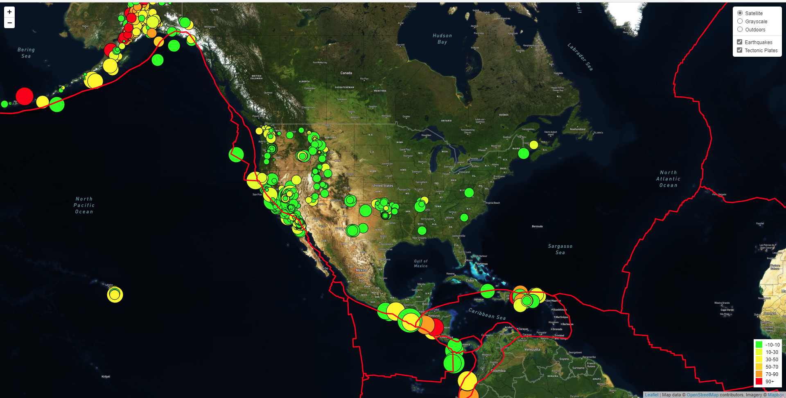
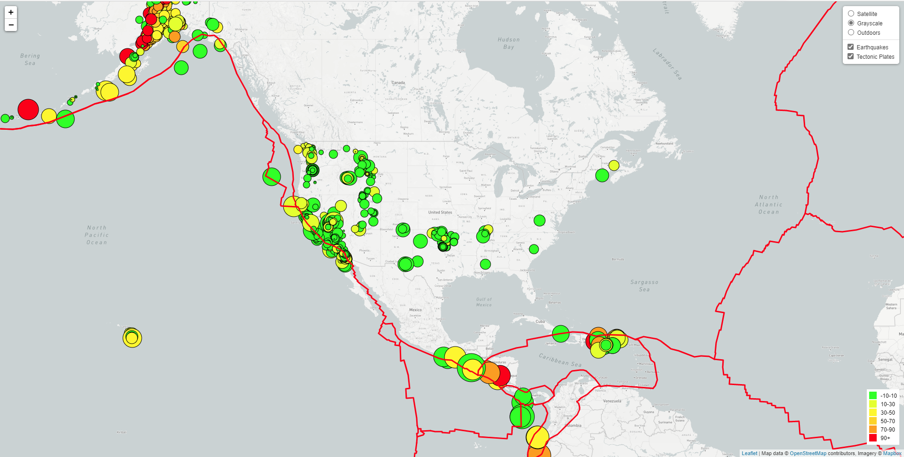
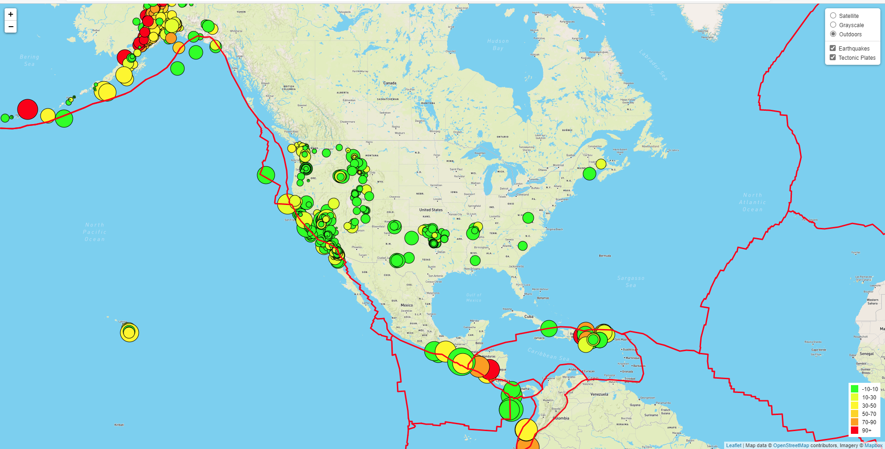

# leaflet-challenge
This respository has map visualization of the weekly Earthquake data from United States Geological Survey, or USGS [GeoJSON Feed](http://earthquake.usgs.gov/earthquakes/feed/v1.0/geojson.php). The visualization has been created with Leaflet and [Mapbox API](https://www.mapbox.com/). An API key would be needed from Mapbox, which will be saved in [config.js](static/js/config.js) file. Multiple map layers have been used to display the Earthquake data. 

The data markers reflect the magnitude of the earthquake by their size and depth of the Earthquake by color. Earthquakes with higher magnitudes appear larger and Earthquakes with greater depth appear darker in color. A pop window with more information will appear when user clicks on the bubble.

A [Tectonic Plate Layer](https://github.com/fraxen/tectonicplates) has also been added to the map to show relationship between tectonic plates and seismic activity.

Herea are images of visualizations with different map layers:

## Satellite Map

## Gray Map

## Outdoors Map
